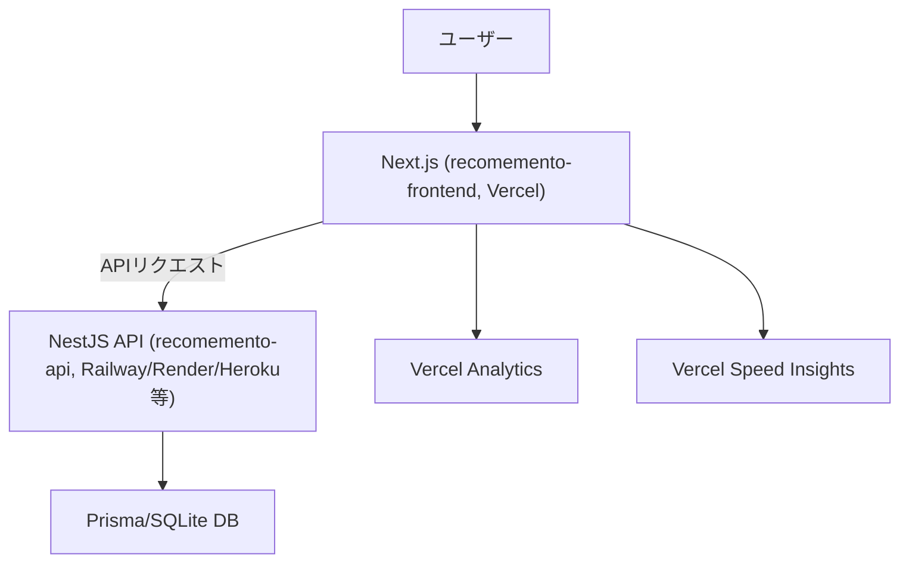

# プロジェクト構成図

```mermaid
graph TD
  User["ユーザー"]
  FE["Next.js (recomemento-frontend, Vercel)"]
  API["NestJS API (recomemento-api, Railway/Render/Heroku等)"]
  DB["Prisma/SQLite DB"]
  Analytics["Vercel Analytics"]
  SpeedInsights["Vercel Speed Insights"]

  User --> FE
  FE -->|APIリクエスト| API
  API --> DB
  FE --> Analytics
  FE --> SpeedInsights
``` 